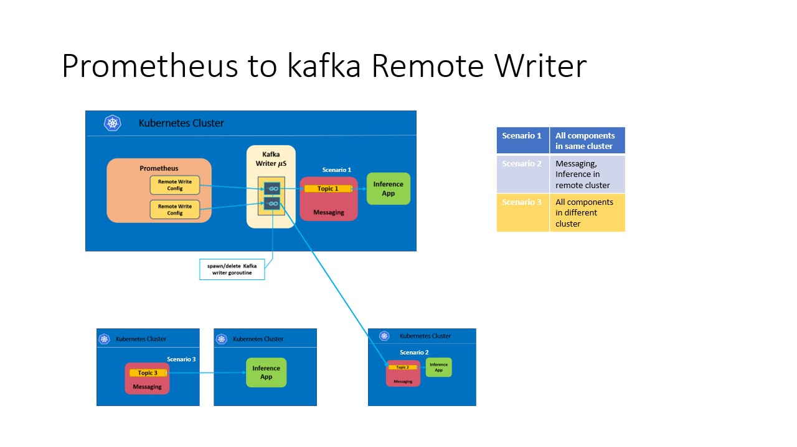

# Prometheus Kafka Remote Writer



Prometheus Kafka remote writer is a remote writer/adapter to publish metrics from prometheus to a remote storage like kafka.
The prom-kafka-writer microservice enables to register the remote endpoint and configures the kafka producer endpoint. 
Prometheus can then be configured to set the remote write to this endpoint and the metrics can be published.

----
## Install
### Build docker images
```bash
git clone https://github.com/onap/demo.git
DA_WORKING_DIR=$PWD/demo/vnfs/DAaaS
cd $DA_WORKING_DIR/microservices/prom-kafka-writer
docker build -f Dockerfile.ci . -t prom-kafka-writer:latest
```
### Deploy using Helm chart
```bash
cd $DA_WORKING_DIR/deploy/collection/charts/prom-kafka-writer

# Modify the values.yaml
helm install -n pkw . -f values.yaml --namespace=edge1
```
Verify the deployment
```bash
kubectl get pods -n edge1 | grep prom-kafka-writer

NAME                                    READY   STATUS             RESTARTS   AGE
pkw-prom-kafka-writer-c6c89c579-jv6jt   1/1     Running            0          11m
```

## API
* Create Prometheus Kafka Writer endpoint

```bash
   //Request
   curl -X POST \
     http://prom-kafka-writer/pkw \
     -H 'Content-Type: application/json' \
     -d '{
    "bootstrap.servers": "kafka-cluster-kafka-bootstrap.kafka.svc.cluster.local:9091",
    "topic": "topic1",
    "usePartition": false,
    "compression.codec": "snappy"
   }'
```

* Delete Prometheus Kafka Writer endpoint
          
```bash
    //Request
    curl -X DELETE http://prom-kafka-writer/pkw/pkw0
```

* List Prometheus Kafka Writers
```bash
    //Request
    curl -X GET http://prom-kafka-writer/pkw
```

* Publish to Kafka Writer
```bash
    //Request
    curl -X POST http://prom-kafka-writer/pkw/pkw0/receive
```
